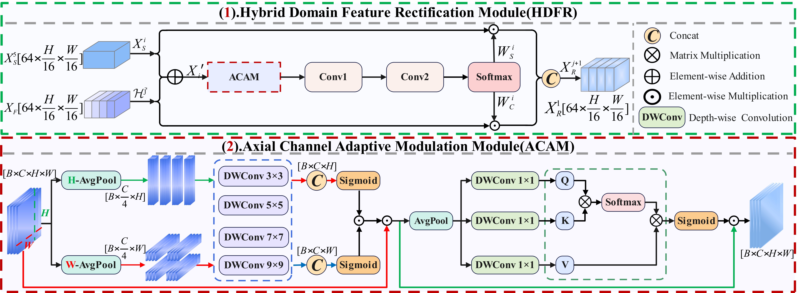
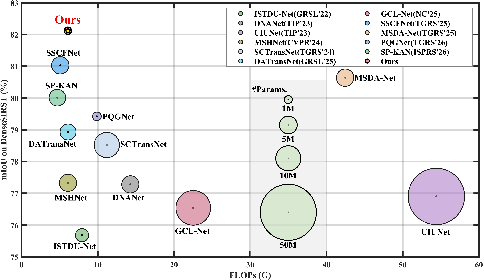
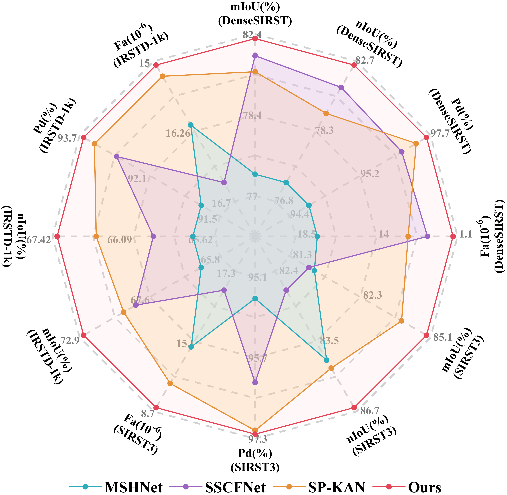
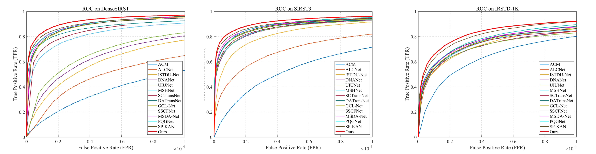
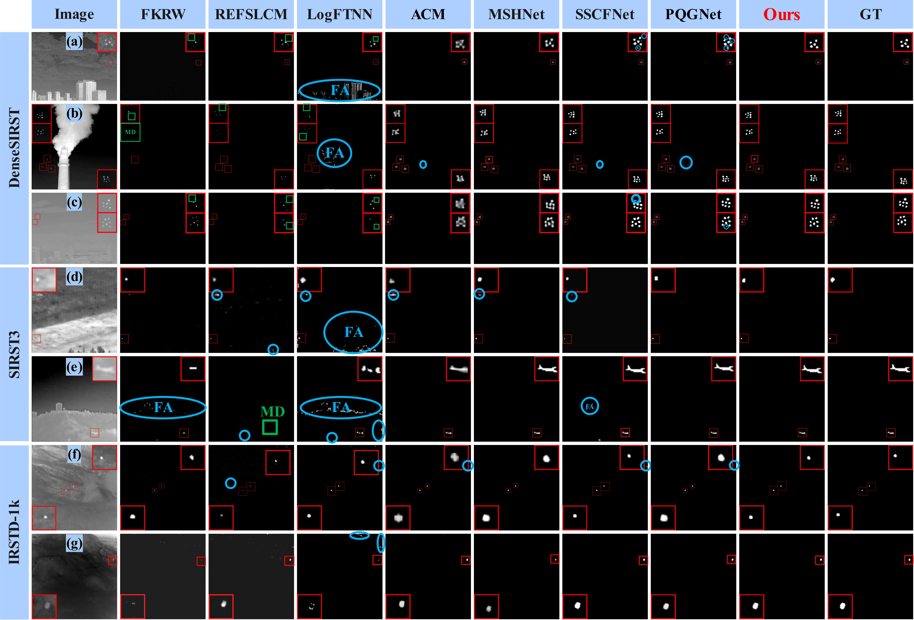

# S<sup>2</sup>DRNet: Spatial–Spectral Differential Rectification with Coupling Suppression for Clustered Infrared Small Target Detection

<div align="center">

**Peng Wang<sup>1</sup>, Ziling Lu<sup>1</sup>, Hankiz Yilahun<sup>1</sup>, Jihong Zhu<sup>2</sup>, Eksan Firkat<sup>3</sup>, and Askar Hamdulla<sup>1</sup>**

<sup>1</sup>School of Computer Science and Technology, Xinjiang University<br>
<sup>2</sup>Department of Precision Instrument, Tsinghua University<br>
<sup>3</sup>Tsinghua Shenzhen International Graduate School, Tsinghua University<br>

[](assets/paper.pdf)
[](#datasets)
[](#how-to-use)
[](index.html)

</div>

---

## News

* **The project page and manuscript PDF are available.**
* **Dataset links and code usage instructions are available.**

If this repository is helpful to your research, please consider giving it a star.⭐⭐⭐

---

## Overview

Infrared small target detection (IRSTD) is crucial in infrared remote sensing, while clustered IRSTD (CIRSTD) is more challenging due to dense target distributions and spatial response coupling. Existing methods remain limited in suppressing spatial response coupling among clustered targets and non-target interference, with insufficient boundary supervision, which may lead to missed detections, false alarms, and boundary ambiguity.

To address these issues, we propose **S<sup>2</sup>DRNet**, a **Spatial–Spectral Differential Rectification Network** for clustered infrared small target detection. The network improves clustered-target discrimination through four complementary components:

1. **MDAM** alleviates response coupling between adjacent targets through collaborative modeling of square local neighborhoods and cross-strip directional neighborhoods.
2. **SDRM** integrates spectral decomposition and multi-directional differential modeling to suppress non-target high-frequency interference.
3. **HDFR** aligns spatial semantic information with spectral structural cues to achieve cross-domain feature rectification.
4. **CBML** alleviates boundary ambiguity from the optimization perspective.

<p align="center">
  
</p>

<div align="center">
  <b>Motivation and overview.</b> Clustered targets suffer from target adhesion, missed detection, and false alarms. S<sup>2</sup>DRNet addresses these issues through spatial aggregation, spectral decoupling, and cross-domain rectification.
</div>

---

## Motivation

CIRSTD should not be regarded as a simple extension of sparse IRSTD. In clustered scenes, the detector must perform refined target-background discrimination jointly driven by spatial aggregation, spectral decoupling, cross-domain rectification, and boundary mining.

The key challenges are summarized as follows:

* **Target-response coupling.** Spatial adjacency among clustered infrared small targets tends to induce mutual response coupling, causing target adhesion and difficult narrow-gap separation.
* **Spectral interference aliasing.** Background edges, high-frequency noise, and target details exhibit similar frequency-domain responses, resulting in aliasing between targets and non-target interference.
* **Cross-domain feature imbalance.** Directly fusing spatial semantic features and frequency-domain structural priors may introduce response imbalance and redundant interference.
* **Insufficient boundary supervision.** Narrow gap regions occupy only a very small proportion of pixels, making conventional segmentation losses insufficient for effective boundary supervision.

---

## Overall Architecture

<p align="center">
  
</p>

<div align="center">
  <b>Overall architecture of S<sup>2</sup>DRNet.</b> The framework performs parallel spatial–spectral feature extraction and hybrid-domain feature rectification for clustered infrared small target detection.
</div>

S<sup>2</sup>DRNet consists of two stages: **parallel spatial–spectral feature extraction** and **hybrid-domain fusion**. The spatial branch progressively extracts multi-scale spatial features through residual blocks and MDAM, while the frequency-domain branch uses SDRM to strengthen weak-target discriminative representations through spectral decoupling. HDFR then fuses spatial features with frequency-domain priors in a bottom-up manner, and CBML strengthens supervision of adjacent-target boundaries and gap regions during training.

---

## Method

### MDAM: Multi-granularity Dynamic Aggregation Module

MDAM enhances clustered-target spatial representation by jointly modeling square local neighborhoods and cross-strip directional neighborhoods:

* **Square dynamic aggregation** enhances weak local target responses within square neighborhoods.
* **Cross-strip dynamic aggregation** models horizontal and vertical strip contexts to alleviate adjacent-target response coupling.

### SDRM: Spectral Differential Representation Module

SDRM introduces lightweight Haar wavelet decomposition and multi-directional differential refinement. It decomposes features into low-frequency structural components and high-frequency details, then preserves structural cues, refines target details, and suppresses edge-noise interference.

<p align="center">
  
</p>

<div align="center">
  <b>Spatial and spectral representation.</b> MDAM models local and cross-strip neighborhoods, while SDRM performs spectral decomposition and differential refinement.
</div>

### HDFR: Hybrid-Domain Feature Rectification Module

<p align="center">
  
</p>

<div align="center">
  <b>Hybrid-domain feature rectification.</b> HDFR adaptively rectifies spatial semantic features and frequency-domain priors through axial-channel adaptive modulation and branch-wise competitive weighting.
</div>

### CBML: Coupling-suppressed Boundary Mining Loss

CBML strengthens target-separation supervision through boundary-gap joint weighting and hard-pixel mining. It emphasizes target contours and narrow background gaps between adjacent targets, thereby reducing target adhesion and boundary ambiguity in clustered infrared scenes.

---

## Datasets

The experiments are conducted on three public infrared small target detection datasets:

* **DenseSIRST** [[DenseSIRST](https://github.com/YimianDai)]: 1,024 images with 13,655 targets, characterized by dense spatial distributions and frequent target adhesion.
* **SIRST3** [[SIRST3](https://github.com/XinyiYing/LESPS)]: 2,755 images integrated from SIRST V1, NUDT-SIRST, and IRSTD-1k, covering diverse scenes, target scales, and background conditions.
* **IRSTD-1k** [[IRSTD-1k](https://drive.google.com/file/d/1JoGDGF96v4CncKZprDnoIor0k1opaLZa/view)]: 1,001 real infrared images with complex backgrounds, weak targets, and low signal-to-noise ratios.


Please organize the datasets according to the dataloader settings in this repository. A typical directory structure can be arranged as follows:

```text
datasets/
├── DenseSIRST/
│   ├── images/
│   ├── masks/
│   └── splits/
├── SIRST3/
│   ├── images/
│   ├── masks/
│   └── splits/
└── IRSTD-1k/
    ├── images/
    ├── masks/
    └── splits/
```


---

## Environment

Create a conda environment:

```bash
conda create -n S2DRNet python=3.11
conda activate S2DRNet
```

Install the required packages:

```bash
pip install torch==2.3.0 torchvision==0.18.0 torchaudio==2.3.0 --index-url https://download.pytorch.org/whl/cu121
pip install scikit-image
pip install PyYAML
pip install tensorboardX
pip install pytest
pip install einops
pip install timm
pip install scikit-learn
pip install opencv-python
pip install ml-collections
pip install thop
pip install tensorboard
pip install matplotlib
pip install albumentations
pip install torchsummary
pip install fvcore
pip install PyWavelets
```

If your CUDA version is fixed, install the PyTorch version that matches your local CUDA toolkit. For example:

```bash
pip install torch==1.13.1+cu116 torchvision==0.14.1+cu116 torchaudio==0.13.1 --extra-index-url https://download.pytorch.org/whl/cu116
```

---

## How to Use

### 1. Data Preparation

Download the required datasets and place them under the `datasets/` directory. Then check the dataset path and split settings in the corresponding configuration or training file.

### 2. Training

```bash
python train.py
python train.py   --model S2DRNet   --dataset DenseSIRST   --dataset_type mask   --cuda_devices 0   --epochs 1000   --lr 1e-3   --seed 42   --edge_weight 3   --hard_ratio 0.5
```


### 3. Testing

```bash
python test.py   --model S2DRNet   --dataset DenseSIRST   --dataset_type mask  
```

Before testing, please set the path of the trained model weights in the testing script or config file.

---

## Results and Trained Models


### Performance-Efficiency Analysis

<p align="center">
  
  
</p>

<div align="center">
  <b>Performance-efficiency comparison.</b> S<sup>2</sup>DRNet maintains a favorable balance between detection accuracy and deployment efficiency.
</div>

---

### ROC Curves

<p align="center">
  
</p>

<div align="center">
  <b>ROC comparison.</b> The proposed method maintains stable detection capability under strict false-alarm constraints on DenseSIRST, SIRST3, and IRSTD-1k.
</div>

---

### Visual Results

<p align="center">
  
</p>

<div align="center">
  <b>Visual comparison.</b> S<sup>2</sup>DRNet separates adjacent targets more clearly and suppresses background interference more effectively.
</div>

---

### Response Distribution Analysis

<p align="center">
  
</p>

<div align="center">
  <b>Three-dimensional response distributions.</b> Sharper and cleaner response peaks indicate more accurate target localization and stronger background suppression.
</div>


---

## Contact

For questions about S<sup>2</sup>DRNet, please open an issue in this repository or contact the authors by email.
